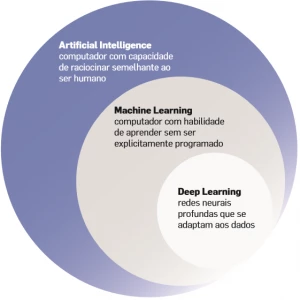
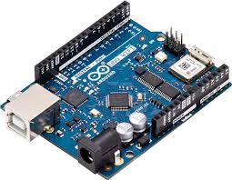
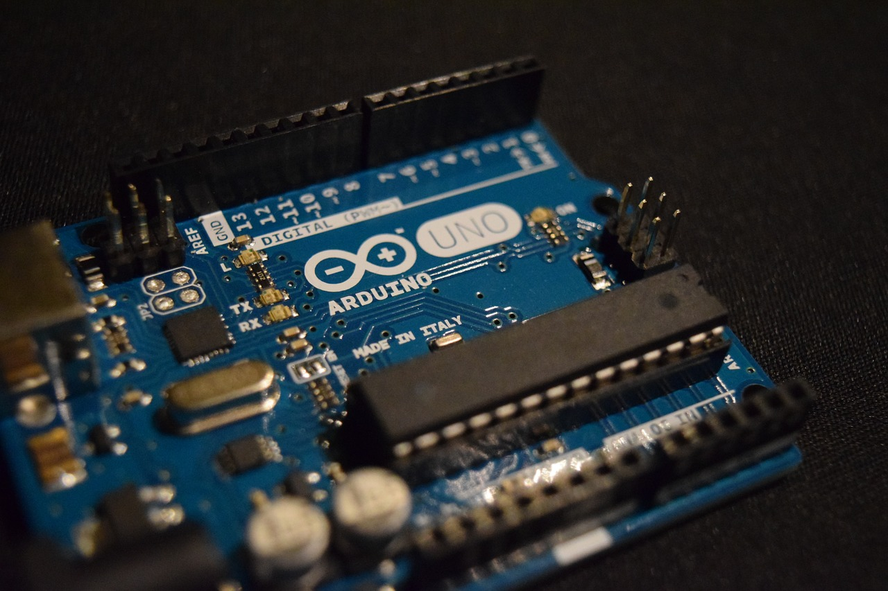
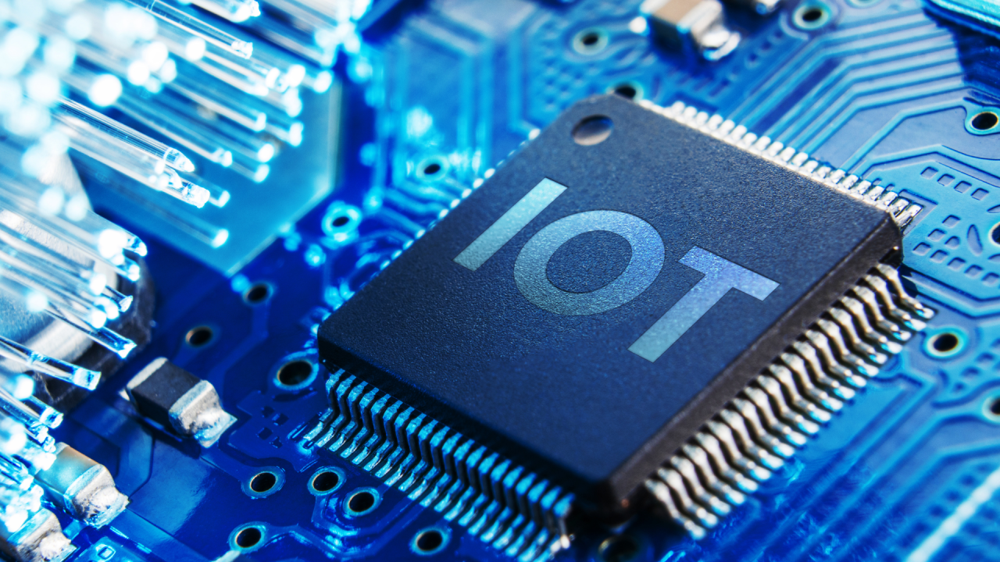

# 📌 Aula 01 - Introdução a Disruptive Architectures: IA, IoT e IoB

Este documento contém um resumo dos principais conceitos abordados na **Aula 01**, incluindo **fundamentos de IA**, **aprendizado de máquina**, **visão computacional**, **fundamentos de IoT** e **arquitetura de microcontroladores**. 🚀

---

## 🏆 **1. Planejamento do Curso**

A disciplina está dividida em dois semestres:

### **📌 Primeiro Semestre - Inteligência Artificial (IA) e Deep Learning**
- Revisão de **Machine Learning**:
  - Aprendizado supervisionado (**classificação e regressão**).
  - Aprendizado não supervisionado (**agrupamento e redução de dimensionalidade**).
- **Introdução ao Deep Learning e Redes Neurais**.
- **Visão Computacional** e aplicações em IA.
- **Processamento de Linguagem Natural (NLP), LLMs e IAs Generativas**.
- **Utilização de modelos de IA na plataforma Hugging Face**.

### **📌 Segundo Semestre - Internet das Coisas (IoT) e IoB**
- **Eletrônica básica** e considerações sobre hardware.
- **Diferença entre microcontroladores e microprocessadores**.
- **Placas de prototipagem**: Arduino UNO e ESP32 (DEVKITv1).
- **Programação em C++ e MicroPython** para IoT.
- **Protocolos de comunicação**: HTTP e MQTT.
- **Plataformas IoT**: thinger.io e ThingSpeak.
- **Uso do NodeRED na nuvem para projetos de IoT**.
- **Azure IoT Hub**.

---

## 🔌 **2. Fundamentos de IA**

A **Inteligência Artificial** permite que sistemas aprendam padrões e tomem decisões baseadas em dados.

📌 **Componentes principais**:
- **Redes neurais** para aprendizado profundo.
- **Modelos generativos** para criação de conteúdo.
- **Plataformas de implementação** como Azure AI e Hugging Face.

⚡ **Aplicações da IA**:
- Automação de processos.
- Reconhecimento de imagem e voz.
- Análise preditiva e personalização de conteúdo.

---

## 🔍 **3. Microcontroladores vs. Microprocessadores**

| Característica | Microcontrolador | Microprocessador |
|---------------|-----------------|-----------------|
| Função | Pequeno sistema embarcado | Cérebro de um computador |
| Uso | Sensores, IoT, automação | PCs, smartphones |
| Programação | Código específico para tarefas | Executa sistemas operacionais |
| Consumo de Energia | Baixo | Alto |

💡 **Placas populares**:
- **Microcontroladores**: Arduino UNO, ESP32
- **Microprocessadores**: Raspberry Pi

---

## 🌐 **4. Protocolos de Comunicação IoT**

Os protocolos são essenciais para a comunicação entre dispositivos IoT.

📌 **Principais protocolos usados**:
- **HTTP**: Baseado em requisições e respostas (usado em APIs RESTful).
- **MQTT**: Leve e eficiente, ideal para IoT.
- **WebSockets**: Comunicação bidirecional em tempo real.

🔹 **Exemplo prático**: Um sensor IoT pode enviar dados via MQTT para um servidor em nuvem, onde serão analisados e utilizados em aplicações de automação.

---

## 🤖 **5. Introdução a IoB (Internet of Behaviors)**

A **Internet dos Comportamentos (IoB)** expande a IoT ao analisar e interpretar dados gerados por usuários.

📌 **Áreas exploradas no curso**:
- **Monitoramento de comportamento humano** através de sensores e dispositivos conectados.
- **Aplicações em marketing digital e experiência do usuário**.
- **Análise de padrões de uso para tomada de decisão**.

🎯 **Plataformas úteis**:
- **Hugging Face** para análise de IA.
- **Azure AI** para implementação de soluções inteligentes.

---

## ✅ **Resumo Final**

| Conceito | Definição |
|----------|-----------|
| **IA** | Modelos inteligentes que aprendem padrões |
| **IoT** | Conexão de dispositivos físicos à internet |
| **IoB** | Análise de dados comportamentais dos usuários |
| **MQTT** | Protocolo de comunicação leve para IoT |
| **Deep Learning** | Modelos avançados de redes neurais |
| **Generative AI** | Modelos de IA que geram novos conteúdos |

📌 **Este resumo serve como referência para os conceitos fundamentais da disciplina.**

---
