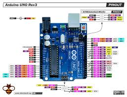
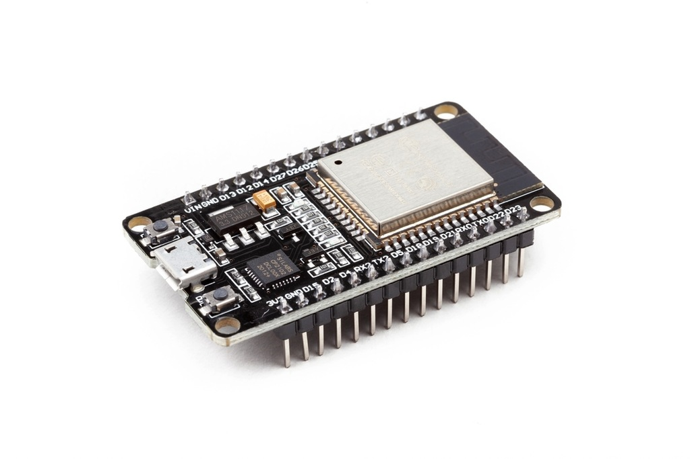
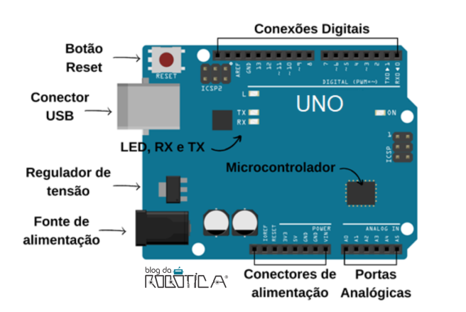
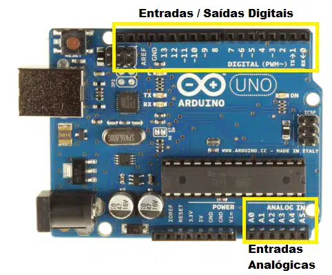

# 📌 Aula 02 - Introdução aos Microcontroladores e Arduino

Este documento contém um resumo dos principais conceitos abordados na **Aula 02**, incluindo **microcontroladores**, **Arduino UNO**, **pinos de entrada e saída (I/O)** e **introdução ao Arduino IDE**. 🚀

---

## 🏆 **1. Objetivos da Aula**
- Compreender o funcionamento dos **microcontroladores**.
- Explorar a arquitetura e os **pinos do Arduino UNO**.
- Aprender sobre **entrada e saída digital e analógica**.
- Introdução ao **Arduino IDE** para programação.


---

## 🔌 **2. O que são Microcontroladores?**

Um **microcontrolador** é um pequeno computador em um único chip que contém:
- **CPU** (processador)
- **Memória RAM e ROM**
- **Interfaces de entrada e saída**

📌 **Principais características:**
- São usados em **dispositivos embarcados**.
- Possuem **baixo consumo de energia**.
- Podem executar **programas específicos** sem necessidade de um sistema operacional.

🔹 **Exemplos de microcontroladores:**
- **Arduino UNO (ATmega328P)**
- **ESP32** (mais avançado, com Wi-Fi e Bluetooth integrados)


---

## 🔍 **3. Estrutura do Arduino UNO**

O **Arduino UNO** é uma placa de prototipagem baseada no microcontrolador **ATmega328P**.

📌 **Principais componentes:**
- **Pinos Digitais (0-13):** Usados para entrada e saída de sinais digitais.
- **Pinos Analógicos (A0-A5):** Leitura de sensores analógicos.
- **Pinos de Alimentação:** 3.3V, 5V, GND e Vin.
- **Porta USB:** Programação e alimentação da placa.
- **Regulador de tensão:** Conversão da fonte de alimentação.

🔹 **Exemplo de uso:**
- Um botão conectado ao pino digital **D2** pode ser usado para acionar um LED no pino **D13**.



---

## 🌐 **4. Pinos de Entrada e Saída (I/O)**

Os **pinos do Arduino** são classificados em:

📌 **Entrada Digital (INPUT)**:
- Lê sinais digitais (0V ou 5V).
- Exemplo: Botão pressionado (HIGH) ou solto (LOW).

📌 **Saída Digital (OUTPUT)**:
- Envia sinais digitais para controlar dispositivos.
- Exemplo: Acender um LED ou ativar um relé.

📌 **Entrada Analógica (ANALOG INPUT)**:
- Lê valores variáveis de **0 a 1023**.
- Exemplo: Sensores de temperatura ou luminosidade.

📌 **Saída PWM (PWM OUTPUT)**:
- Simula sinais analógicos através de modulação de largura de pulso.
- Exemplo: Controle da intensidade de um LED.

🔹 **Diagrama dos pinos do Arduino:**



---

## 🖥 **5. Introdução ao Arduino IDE**

O **Arduino IDE** é o ambiente de programação para escrever e carregar códigos no Arduino.

📌 **Passos básicos:**
1. Instalar o **Arduino IDE**.
2. Conectar o **Arduino UNO via USB**.
3. Selecionar a porta correta no menu **Ferramentas > Porta**.
4. Escrever um **programa simples** (ex: piscar um LED com `digitalWrite`).
5. Fazer o **upload do código** para a placa.

🔹 **Exemplo de código simples (Pisca LED no pino 13):**
```cpp
void setup() {
  pinMode(13, OUTPUT);
}

void loop() {
  digitalWrite(13, HIGH);
  delay(1000);
  digitalWrite(13, LOW);
  delay(1000);
}
```


---

## ✅ **Resumo Final**

| Conceito | Definição |
|----------|-----------|
| **Microcontrolador** | Pequeno computador embarcado para controle de dispositivos |
| **Arduino UNO** | Placa de prototipagem baseada no ATmega328P |
| **Pinos Digitais** | Entrada e saída de sinais digitais (0V ou 5V) |
| **Pinos Analógicos** | Leitura de valores variáveis (0-1023) |
| **PWM** | Simulação de sinal analógico usando pulsos |
| **Arduino IDE** | Ambiente de programação para Arduino |

📌 **Este resumo serve como referência para os conceitos fundamentais da disciplina.**


---
